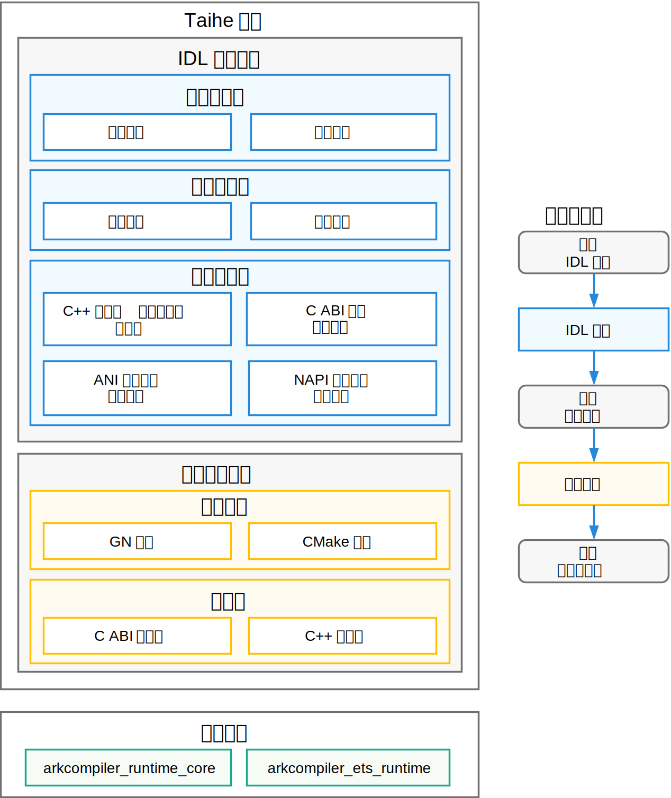

# Taihe 跨语言接口定义与代码生成工具

## 简介

Taihe 是一个面向 OpenHarmony 生态的跨语言接口定义与代码生成工具。Taihe 作为连接不同编程语言（如 ArkTS、C++、C）的桥梁，通过统一的接口定义语言（IDL，Interface Definition Language）和自动化的代码生成流程，简化跨语言开发的复杂性，提高了接口演进的灵活性和开发效率，并实现 API 的发布方与消费方在二进制级别的隔离。

**图1** Taihe 架构图



如图，Taihe 工具由 **IDL 编译组件**和**项目构建组件**两大内部组件构成，并依赖外部运行时提供语言桥接能力。使用 Taihe 工具时，开发者首先编写 IDL 文件描述跨语言接口，运行 Taihe 编译器生成多种语言之间的桥接代码，然后在生成的框架中填充实现具体的业务逻辑代码，最后通过 Taihe 提供的相关构建模板，结合 Taihe 运行时库编译链接，得到最终的可执行产物（如动态库、字节码等）。

### 组件说明

**IDL 编译组件**

Taihe IDL 编译器负责将 `.taihe` 接口描述文件解析并编译为目标语言代码。编译器内部由三部分组成：

- **编译器前端**：进行词法分析和语法分析，将 IDL 源文件转换为编译器内部的中间表示（IR，Intermediate Representation）。
- **编译器核心**：对中间表示进行类型检查、名称解析和语义验证，确保接口定义正确无误。
- **编译器后端**：采用插件化设计，将经过验证的中间表示转换为目标语言代码。每个代码生成后端以插件形式存在，负责独立的代码生成，后端之间通过声明依赖关系自动组合——用户只需指定最终需要的后端，编译器会自动启用其所依赖的全部后端。当前提供以下代码生成后端：
  - **C ABI 代码生成后端**：生成与语言无关的 C ABI 层头文件和源文件，是所有其它语言后端的基础。
  - **C++ 投影和模板代码生成后端**：在 C ABI 之上生成 C++ 类型投影、接口提供方实现模板和消费方使用的头文件。
  - **ANI → ArkTS-Sta 桥接代码生成后端**：生成 [ANI（ArkTS Native Interface）](https://gitcode.com/openharmony/docs/blob/OpenHarmony_feature_20250702/zh-cn/application-dev/ani/ani-usage-scenarios.md)桥接代码和 [ArkTS-Sta](https://gitcode.com/openharmony/docs/blob/OpenHarmony_feature_20250702/zh-cn/application-dev/quick-start/arkts-sta-user-guide.md) 投影代码，使 ArkTS-Sta 代码能够调用 C++ 实现。
  - **NAPI → ArkTS-Dyn 桥接代码生成后端**：生成 [NAPI（Node-API）](https://gitcode.com/openharmony/docs/blob/master/zh-cn/application-dev/napi/napi-introduction.md)桥接代码和 [ArkTS-Dyn](https://gitcode.com/openharmony/docs/blob/master/zh-cn/application-dev/arkts-utils/arkts-overview.md) 投影代码，使 ArkTS-Dyn 代码能够调用 C++ 实现。

**项目构建组件**

- **构建模板**：Taihe 提供了适配不同构建系统的项目模板，帮助用户将生成的代码无缝集成到现有项目的构建流程中。包括适用于 OpenHarmony 平台的 **GN 模板**和适用于本地开发测试的 **CMake 模板**。
- **运行时**：Taihe 运行时库为跨语言调用提供底层支撑，包括实现与语言无关的二进制接口约定的 **C ABI 运行时**，以及在其之上提供 C++ 风格类型封装（如 `string`、`array`、`map` 等容器类型）和引用计数内存管理的 **C++ 运行时**。

**外部依赖**

Taihe 生成的桥接代码在运行时依赖以下外部组件：

- **arkcompiler_runtime_core**：方舟编译器运行时核心，为 ArkTS-Sta 提供 ANI FFI（Foreign Function Interface）能力，是 ANI 桥接代码的运行时基础。
- **arkcompiler_ets_runtime**：方舟编译器 ETS 运行时，为 ArkTS-Dyn 提供 NAPI FFI（Foreign Function Interface）能力，是 NAPI 桥接代码的运行时基础。

以上各组件的详细设计文档参见 [Taihe 内部设计文档](#taihe-内部设计文档) 一节。

## 主要目录结构


```
arkcompiler/taihe_ffi_gen
├── compiler/              # - IDL 编译组件
│   ├── Taihe.g4           #     - ANTLR 语法定义
│   └── taihe/             #
│       ├── utils/         #     - 编译器工具库（错误处理、日志、辅助函数等）
│       ├── cli/           #     - 命令行工具入口（taihec、taihe-tryit）
│       ├── driver/        #     - 编译器整体流程驱动
│       ├── parse/         #     - 编译器前端（词法分析、语法分析）
│       ├── semantics/     #     - 编译器核心（中间表示的类型系统、语义分析）
│       └── codegen/       #     - 编译器后端（代码生成）
│           ├── abi/       #         - C ABI 代码生成后端
│           ├── cpp/       #         - C++ 投影和模板代码生成后端
│           ├── ani/       #         - ANI → ArkTS-Sta 桥接代码生成后端
│           └── napi/      #         - NAPI → ArkTS-Dyn 桥接代码生成后端
├── stdlib/                #     - Taihe 标准库（编译器内置的 IDL 定义文件）
├── runtime/               # - 项目构建组件：运行时及构建模板
│   ├── include/           #     - C ABI 及 C++ 运行时头文件
│   │   └── taihe/         #
│   └── src/               #     - 运行时实现
├── BUILD.gn               #     - GN 构建模板（OpenHarmony 场景）
├── cmake/                 #     - CMake 构建模板（本地开发/测试场景）
├── test/                  # - 测试工程
├── cookbook/              # - 示例工程
└── docs/                  # - 文档
    ├── public/            #     - 面向 Taihe 使用者的文档
    │   ├── spec/          #         - IDL 语言规范
    │   ├── backend-cpp/   #         - C++ 开发指南
    │   ├── backend-ani/   #         - ArkTS-Sta / ANI 开发指南
    │   └── backend-napi/  #         - ArkTS-Dyn / NAPI 开发指南
    └── internal/          #     - Taihe 内部设计文档
        ├── compiler/      #         - 编译器设计文档
        └── runtime/       #         - 运行时设计文档
```

## 约束

**操作系统**：Ubuntu Linux 22.04（版本固定，不推荐升级）。

**编译器**：Python 3.11（版本固定，不推荐升级）。

**运行时**：需使用 C++17 标准编译（版本固定，不推荐升级）。

**配套构建工具**：CMake 3.18 及以上（本地开发/测试）；GN + Ninja（OpenHarmony 场景）。

## 编译构建

支持在 Linux 平台编译出适用于 Windows/Linux/macOS 的多平台版本。

OpenHarmony 环境下的编译命令如下：

```sh
./build.sh --product-name rk3568 --build-target build_taihe_wrapper
```

## 使用说明

### 命令行工具

Taihe 提供了以下两个命令行工具：

- **`taihec`**：核心编译器，用于解析 Taihe IDL 文件并生成目标语言代码。
- **`taihe-tryit`**：集成测试工具，用于快速创建、生成、编译和运行测试工程。

具体使用说明和开发流程请参考 [Taihe 命令行工具文档](/docs/public/CliReference.md)。

### IDL 语言规范

具体请参考 [Taihe IDL 语言规范](docs/public/spec/IdlReference.md)。

### 目标语言开发指南

Taihe 支持将 C++ 实现的接口暴露给不同的目标语言调用。下面按目标语言分类列出了相关文档。如果是初次使用 Taihe 进行跨语言开发，建议从快速入门教程开始。

**ArkTS-Sta（通过 ANI 桥接）**

适用于将 C++ 实现暴露给 ArkTS 静态类型代码调用的场景。

- [快速入门](docs/public/backend-ani/AniQuickStart.md)：使用 Taihe 定义接口并在 ArkTS-Sta 中调用的快速入门教程（以集成测试场景为例）。
- [生成代码说明](docs/public/backend-ani/AniGeneratedCode.md)：Taihe 编译器为 ANI/ArkTS 生成的桥接代码和 ArkTS 投影代码的结构与内容说明。
- [`.d.ts` 文件与 Taihe IDL 间的映射关系](docs/public/backend-ani/DtsToIdlConversion.md)：根据已有的 ArkTS-Sta `.d.ts` 文件来编写 Taihe IDL 文件的说明文档，帮助用户理解如何将现有的 ArkTS 接口定义转换为 Taihe IDL 定义。
- [ArkTS 通用注解](docs/public/spec/supported-attributes/ArkTSAttributes.md) 和 [ArkTS-Sta 特有注解](docs/public/spec/supported-attributes/AniAttributes.md)：ANI/ArkTS 支持的 Taihe IDL 注解列表及其说明。
- [示例工程和教程](cookbook/quick_ref/README.md)：按照特性分类的 ANI/ArkTS 示例工程和教程。

**ArkTS-Dyn（通过 NAPI 桥接）**

适用于将 C++ 实现暴露给 ArkTS 动态类型代码调用的场景。

- [快速入门](docs/public/backend-napi/NapiQuickStart.md)：使用 Taihe 定义接口并在 ArkTS-Dyn 中调用的快速入门教程（以集成测试场景为例）。
- [使用指南](docs/public/backend-napi/NapiUsageGuide.md)：Taihe IDL 中定义的接口和数据结构在 ArkTS/NAPI 侧的使用说明，包括接口实现、数据类型映射、Taihe NAPI 运行时库的使用等内容。
- [ArkTS 通用注解](docs/public/spec/supported-attributes/ArkTSAttributes.md) 和 [ArkTS-Dyn 特有注解](docs/public/spec/supported-attributes/NapiAttributes.md)：NAPI/ArkTS 支持的 Taihe IDL 注解列表及其说明。

**C++**

适用于 C++ 模块之间通过 Taihe 进行接口解耦的场景。

- [C++ 使用指南](docs/public/backend-cpp/CppUsageGuide.md)：Taihe IDL 中定义的接口和数据结构在 C++ 侧的使用说明，包括接口实现、数据类型映射、Taihe C++ 运行时库的使用等内容。
- [生成代码说明](docs/public/backend-cpp/CppGeneratedCode.md)：Taihe 编译器为 C++ 生成的代码结构和内容说明。

## Taihe 内部设计文档

以下文档面向 Taihe 项目的代码贡献者，包含编译器的架构设计、核心算法、数据结构以及 Taihe 定义的 ABI 规范等内容：

**编译器相关**

- [编译器整体设计文档](docs/internal/compiler/Compiler.md)：Taihe 编译器的整体架构设计、模块划分、核心算法和数据结构说明。
- [Taihe IR 设计文档](docs/internal/compiler/IRDesign.md)：Taihe 编译器中间表示的设计说明，包括数据结构、构造和访问等。
- [注解系统设计文档](docs/internal/compiler/AttributeSystem.md)：Taihe IDL 注解系统的设计说明，包括注解的语法、语义、编译器中的处理流程以及如何在后端代码生成中使用注解信息等内容。
- [Taihe 编译器后端开发文档](docs/internal/compiler/BackendAndOptions.md)：编写 Taihe 编译器后端（如 C++、ANI、NAPI）的开发指南，包括后端中的阶段划分、各个阶段的职责和约束、与整体编译流程的交互、编译选项的设计和实现等。

**运行时相关**

- [Taihe ABI 文档](docs/internal/runtime/AbiStandard.md)：Taihe 定义的跨语言调用约定和数据类型表示规范。
- [Taihe 面向对象/接口系统设计和实现文档](docs/internal/runtime/InterfaceAbi.md)：Taihe 面向对象系统设计和 ABI 规范的详细说明，包括对象模型、内存管理、接口调用约定等内容。
- [运行时头文件职责划分说明](docs/internal/runtime/RuntimeHeaders.md)：Taihe 运行时库中头文件的职责划分和内容说明。

## 相关仓

[**arkcompiler_taihe_ffi_gen**](https://gitcode.com/openharmony-sig/arkcompiler_taihe_ffi_gen)

[arkcompiler_runtime_core](https://gitcode.com/openharmony/arkcompiler_runtime_core)

[arkcompiler_ets_runtime](https://gitcode.com/openharmony/arkcompiler_ets_runtime)
