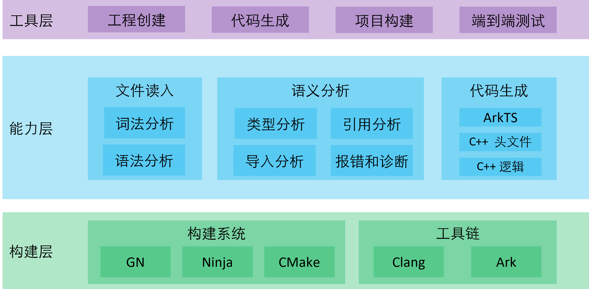

# 太和跨语言接口生成工具

## 简介

Taihe是一个多语言系统接口编程模型，为OpenHarmony生态系统提供跨语言接口定义、桥接代码生成。Taihe作为连接不同编程语言（如 ArkTS、C++、C）的桥梁，实现API的发布方与消费方在二进制级别的隔离。

**图1** 太和跨语言接口生成工具架构图



## 目录

```
arkcompiler/taihe_ffi_gen
├── compiler/              # 编译器源代码
│   ├── taihe/             # 编译器核心代码
│   │   ├── cli/           # 命令行接口
│   │   ├── codegen/       # 代码生成后端
│   │   │   ├── abi/       # ABI 层代码生成
│   │   │   ├── ani/       # ANI 桥接代码生成
│   │   │   ├── cpp/       # C++ 投影生成
│   │   │   └── napi/      # Node-API 桥接代码生成
│   │   ├── driver/        # 编译器驱动
│   │   ├── parse/         # 语法解析
│   │   ├── semantics/     # 语义分析
│   │   └── utils/         # 工具函数
│   ├── Taihe.g4           # ANTLR 语法定义
│   └── tests/             # 编译器单元测试
├── runtime/               # 运行时库
│   ├── include/           # 运行时头文件
│   │   └── taihe/         # 公共运行时头文件
│   └── src/               # 运行时源代码
├── stdlib/                # 标准库IDL文件
├── test/                  # 集成测试
│   ├── ani_*              # ANI 桥接代码测试用例
│   ├── napi_*             # N-API 桥接代码测试用例
│   └── cmake_test         # CMake 构建测试
├── cookbook/              # 示例项目
│   ├── hello_world/       # Hello World示例
│   ├── callback/          # 回调函数示例
│   ├── class/             # 类示例
│   └── ...                # 更多示例
├── docs/                  # 文档
│   ├── public/            # 用户文档
│   │   ├── spec/          # 语言规范
│   │   ├── backend-ani/   # ANI后端文档
│   │   ├── backend-cpp/   # C++后端文档
│   │   └── backend-napi/  # Node-API后端文档
│   └── internal/          # 开发者文档
│       ├── compiler/      # 编译器架构文档
│       └── runtime/       # 运行时架构文档
├── scripts/               # 构建和测试脚本
│   ├── build              # 构建脚本
│   └── autofix            # 代码格式化脚本
├── cmake/                 # CMake构建配置
│   ├── TaiheUtils.cmake   # CMake工具函数
│   └── TaiheWorkflows.cmake # CMake工作流
├── build.py               # 构建脚本
├── setup.py               # 打包脚本
├── pyproject.toml         # 项目配置
├── CMakeLists.txt         # CMake主配置
├── BUILD.gn               # GN构建配置
└── bundle.json            # 组件打包配置
```

## 约束

**操作系统**：Ubuntu Linux 22.04

**运行时**：C++ 17

**编译器**：Python 3.11 

## 编译构建

Taihe工具采用命令行交互方式，支持解析IDL代码并自动生成对应语言的桥接代码。可在 Linux 平台编译出适用于 Windows/Linux/macOS 的多平台版本。

```
$ ./build.sh --product-name rk3568 --build-target build_taihe_wrapper
```

## 说明

### 使用说明

Taihe 提供以下命令行工具：

- **`taihec`**：核心编译器，用于解析 Taihe IDL 文件并生成目标语言代码
- **`taihe-tryit`**：集成测试工具，用于快速创建、生成、编译和运行测试项目

具体使用说明请参考：[命令行工具参考](/docs/public/CliReference.md)

## 相关仓

[**arkcompiler_taihe_ffi_gen**](https://gitcode.com/openharmony-sig/arkcompiler_taihe_ffi_gen)

[arkcompiler\_runtime\_core](https://gitcode.com/openharmony/arkcompiler_runtime_core)
